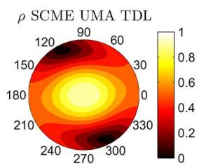
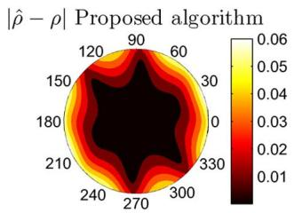
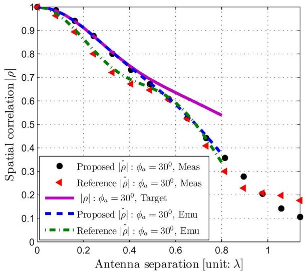
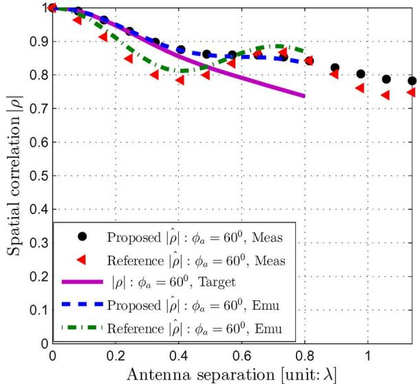

# Emulating Spatial Characteristics of MIMO Channels for OTA Testing

## 📋 基本信息

| 字段 | 内容 |
|------|------|
| **作者** | Wei Fan, Xavier Carreño Bautista de Lisbona, Fan Sun, Jesper Ødum Nielsen, Mikael Bergholz Knudsen, Gert Frølund Pedersen |
| **期刊/会议** | IEEE Transactions on Antennas and Propagation (TAP) |
| **年份** | 2013 |
| **DOI** | 待确认 |
| **链接** | |
| **标签** | #OTA测试 #MIMO #凸优化 #空间相关性 #PAS #PFS |

## 🎯 核心问题

> MIMO OTA 测试中，如何用有限数量的探头精确复现目标信道的**空间特性**（空间相关性 + PAS 形状）？现有方法只优化空间相关性而忽略 PAS 形状约束（AoA/AS），且数值优化计算效率极低。

## 🔬 现有研究问题与本文方案对比

| 现有方法 | 存在的问题 | 本文解决方案 | 本文优势 |
|----------|-----------|-------------|----------|
| 数值优化/穷举搜索 [5][6] | 计算效率极低，不可扩展 | 凸优化框架（二次规划） | 计算复杂度大幅降低，可用 CVX 高效求解 |
| 仅优化 $\|\rho\|-\|\hat\rho\|$ [6] | 忽略 PAS 形状（AoA/AS），不同 PAS 可能产生相同相关性 | 加入 AoA + AS 误差容限作为硬约束 | 保证仿真出的离散 PAS 在形状上逼近目标连续 PAS |
| 空间样本选在一条线 [3] 或一个圆 [5] | 只在固定方向/间距最优，测试区域其他位置可能很差 | 样本覆盖**整个测试区域**（$d$ 和 $\phi_a$ 二维扫描） | 全测试区域空间相关性均得到优化 |
| EB 商用信道仿真器算法 [3][4] | 仅优化固定天线方向，且 PAS 约束不明确 | 联合优化相关性 + PAS 约束 | 相关性误差 0.03 vs 0.06（SCME UMA），AoA/AS 更准 |

## 🧠 方法/模型

### 🔑 关键物理直觉

**PAS 决定了空间相关性——但反过来不成立。** 两个完全不同的 PAS 可能在有限采样点（如一条线或一个圆）上产生几乎相同的空间相关性值。如果优化器只被告知"让相关性匹配"，它可能收敛到一个数学上正确但物理上完全错误的探头功率分配——重建的 PAS 形状与目标相差甚远。

换句话说：**相关性是 PAS 的投影，不是 PAS 本身。** 要从有限探头重建物理信道，必须同时约束投影和原像。

### 核心思路（分步详解）

#### Step 1：空间相关性的离散化建模

直觉：连续 PAS 产生连续的空间相关性函数；有限探头产生离散 PAS，对应离散的空间相关性。两者的差异就是仿真误差。

公式（连续目标空间相关性，假设全向天线）：

$$
\rho(d, \phi_a) = \int_{-\pi}^{\pi} \exp\!\left(-j 2\pi \frac{d}{\lambda} \sin(\phi_p - \phi_a)\right) p(\phi_p) \, d\phi_p \tag{2}
$$

含义：目标空间相关性 = PAS $p(\phi_p)$ 与天线间相位差 $\exp(-j2\pi d/\lambda \sin(\cdot))$ 的内积。自变量是天线间距 $d$ 和阵列朝向 $\phi_a$。

公式（离散仿真空间相关性）：

$$
\hat\rho(d, \phi_a) = \boldsymbol{w}^T \cdot \boldsymbol{a}(d, \phi_a) \tag{3}
$$

其中 $a_n(d, \phi_a) = \exp(-j 2\pi d/\lambda \sin(\theta_n - \phi_a))$，$\boldsymbol{w}=[w_1,\dots,w_N]^T$ 是探头功率权重向量。

含义：离散空间相关性 = 探头权重对每个探头贡献的加权和。**问题转化为：找最优 $\boldsymbol{w}$ 使 $\hat\rho$ 逼近 $\rho$。**

#### Step 2：引入 PAS 形状约束

直觉：光让相关性匹配还不够——必须确保重建出的离散 PAS 在形状上（AoA 和 AS）不偏离目标。

公式（离散 PAS 的 AoA 和 AS）：

$$
\overline{\phi}^{\mathrm{OTA}} = \sum_{i=1}^{N} \chi_i w_i = \mathbf{b}^T \boldsymbol{w} \tag{5}
$$

$$
\sigma^{\mathrm{OTA}} = \sqrt{\sum_{i=1}^{N} (\chi_i - \overline{\phi}_p)^2 w_i} = \sqrt{\mathbf{c}^T \boldsymbol{w}} \tag{6}
$$

其中 $\chi_i$ 是探头角度 $\theta_i$ 经过循环角度校正后的值（处理 $\pm\pi$ 环绕）。

含义：离散 PAS 的 AoA 就是探头角度的加权平均，AS 就是加权标准差。约束 $|\mathbf{b}^T\boldsymbol{w} - \overline{\phi}_p| \le \epsilon_{\mathrm{AoA}}$ 和 $|\mathbf{c}^T\boldsymbol{w} - \sigma_p^2| \le \epsilon_{\mathrm{AS}}$ 保证重建的形状不跑偏。

额外物理约束：**离目标 AoA 更近的探头应分配更高功率**（$w_i \ge w_j$ 当 $|\theta_i-\overline{\phi}_p| \le |\theta_j-\overline{\phi}_p|$），这符合电磁传播直觉。

#### Step 3：凸优化问题建模

直觉：目标函数是 $\|\hat{\boldsymbol\rho} - \boldsymbol\rho\|_2^2$（空间相关性向量的二范数误差），所有约束都是**线性的**——这是标准的凸二次规划，全局最优解存在且唯一，求解极其高效。

完整优化问题：

$$
\begin{aligned}
\min_{\boldsymbol{w}} \quad & \|\hat{\boldsymbol\rho}(\boldsymbol{w}) - \boldsymbol\rho\|_2^2 \\
\mathrm{s.t.} \quad & \|\boldsymbol{w}\|_1 = 1, \quad 0 \le w_i \le 1 \quad (\forall i) \\
& |\mathbf{b}^T\boldsymbol{w} - \overline{\phi}_p| \le \epsilon_{\mathrm{AoA}} \\
& \mathbf{c}^T\boldsymbol{w} \le (\epsilon_{\mathrm{AS}} + \sigma_p)^2, \quad \mathbf{c}^T\boldsymbol{w} \ge (\epsilon_{\mathrm{AS}} - \sigma_p)^2 \\
& w_i \ge w_j, \quad \text{if } |\theta_i - \overline{\phi}_p| \le |\theta_j - \overline{\phi}_p| \quad (i \ne j)
\end{aligned} \tag{4}
$$

含义：
- **目标**：最小化仿真与目标空间相关性的偏差（二范数）
- **归一化**：探头功率和为 1，每个探头功率在 [0,1]
- **AoA 约束**：离散 PAS 的 AoA 偏离目标不超过 $\epsilon_{\mathrm{AoA}}$
- **AS 约束**：离散 PAS 的 AS 偏离目标不超过 $\epsilon_{\mathrm{AS}}$
- **单调性约束**：离目标 AoA 越近，功率越高

#### Step 4：全测试区域空间样本选取

直觉：如果只在一条线或一个圆上选采样点优化，优化器会在那些点上表现完美，但在测试区域的其他位置（不同 $d$ 或 $\phi_a$）可能很差。**你在一个好的采样点上欺骗了优化器，但物理信道不会只在这一条线上工作。**

方案：**二维扫描**——$d$ 从 0 线性步进到测试区域尺寸 $D$，同时 $\phi_a$ 从 0 线性步进到 $2\pi$。这样优化器看到的是整个测试区域的空间相关性图景，必须找到一个在所有位置都好的解。

有意思的是：当采样点覆盖全测试区域后，PAS 形状约束通常自动满足——因为"够多的采样点"本身就在隐式地约束 PAS 形状。

### 系统框图

> MIMO OTA 系统 = BS 仿真器 → 信道仿真器（多路独立衰落）→ 功率放大器 → OTA 环上的探头天线 → 暗室中的 DUT

关键设计权衡：
- **探头数量 vs 测试区域大小**：探头越多，可支持的测试区域越大（Fig. 10 给出了定量关系）
- **PAS 形状 vs 仿真精度**：AS 太小的簇（如接近 LOS）可能导致凸优化无解——约束无法同时满足
- **探头固定 vs 灵活**：实际系统中探头位置固定（频繁重新校准不现实），本文假设固定探头角度

## 📐 关键公式

| 编号 | 含义 |
|------|------|
| (2) | 目标空间相关性（连续 PAS 积分） |
| (3) | 仿真空间相关性（离散探头加权） |
| (4) | 完整凸优化问题（目标 + 5 类线性约束） |
| (5) | 离散 PAS 的 AoA（探头角度加权平均） |
| (6) | 离散 PAS 的 AS（探头角度加权标准差） |
| (7) | 实测空间相关性（CIR 样本协方差） |

## 💻 实验设置

**概述**：4 组实验——① 不同 PAS 形状的仿真误差对比 ② 与文献 [6] 和 EB 商用仿真器算法的对比 ③ 信道模型对仿真精度的影响 ④ 实测验证（暗室 + EB 信道仿真器）。

**信号**：SCME UMA TDL 模型（6 个 Laplacian 簇），载频 2450 MHz，移动速度 30 km/h，每波长 4 采样点。

**仪器**：16 个双极化喇叭天线（只用 8 个，等间距 45°）、EB 信道仿真器 ×2、网络分析仪、Satimo 电偶极子 sleeve 天线、转台。

| 方案 | 含义 | 关键参数 |
|------|------|---------|
| Proposed | 凸优化 + PAS 约束 + 全覆盖采样 | 8 探头，测试区域 $0.5\lambda$，$\epsilon_{\mathrm{AoA}}=\epsilon_{\mathrm{AS}}=1^\circ$ |
| Reference [3][4] | EB 仿真器内置算法（LSE，固定天线方向优化） | 同配置 |
| Method [6] | 仅优化 $\|\rho\|-\|\hat\rho\|$，固定间距 $d=0.5\lambda$ | 同配置 |

**评估指标**：
- **空间相关性误差** $|\hat\rho - \rho|$（每个 $(d, \phi_a)$ 位置的绝对偏差）
- **最大相关性误差**（测试区域内最差位置的值）
- **AoA/AS 偏差**（离散 PAS 与目标 PAS 的 AoA/AS 差异）

## 📊 主要结果

### 结果 1：空间相关性仿真精度（vs 文献方法）

**空间相关性误差**衡量每个天线位置 $(d, \phi_a)$ 上仿真与目标空间相关性的绝对偏差：

$$
\text{Correlation Error}(d, \phi_a) = |\hat\rho(d, \phi_a) - \rho(d, \phi_a)|
$$

- **观察**：SCME UMA TDL 模型（6 簇）下，本文算法在测试区域 $0.5\lambda$ 内，最大相关性误差仅 0.03
- **原因**：凸优化框架 + 全覆盖采样确保在所有 $(d, \phi_a)$ 位置找到全局最优的权衡
- **结论**：**本文算法的仿真精度是文献 [6]（最大 0.07）和 EB 商用算法（最大 0.06）的 2 倍以上**

### 结果 2：逐簇误差对比 —— 为什么全覆盖采样重要

- **观察**：方法 [6] 在优化点 $d=0.5\lambda$ 处误差仅 0.01，但在 $d=0.25\lambda$ 处飙升到 0.12；Reference 方法在 $\phi_a=120^\circ$ 附近误差显著偏大；**本文算法在所有天线间距和方向上误差均匀地小**
- **原因**：方法 [6] 只在一个固定 $d$ 上优化——它在那个点上"过度拟合"了；Reference 方法只优化几个固定 $\phi_a$
- **结论**：这是本文最关键的 insight——**空间样本的选取直接决定了仿真器在整个测试区域的泛化能力**

### 结果 3：PAS 形状约束的效果

**AoA/AS 偏差**衡量离散 PAS 与目标连续 PAS 在形状参数上的差异（Table II，以第 1 簇为例，目标 AoA=65.7°, AS=35°）：

| 方法 | AS (°) | AoA (°) |
|------|--------|---------|
| Reference [3][4] | 36.4 | 64.1 |
| Method [6] | 52.7 | 71.5 |
| **Proposed** | **35.0** | **66.0** |

- **观察**：方法 [6] 的 AS 偏差高达 17.7°（+50%），本文仅 0° 偏差
- **原因**：方法 [6] 不约束 PAS 形状——它找到一个数学上优化相关性但物理上完全不同的 PAS
- **结论**：**不加 PAS 约束 = 允许优化器"作弊"**。这在工程上不可接受——因为 PAS 形状直接影响波束赋形和分集增益的评估

### 结果 4：实测验证

- **观察**：实测空间相关性与仿真结果高度吻合；在 $\phi_a = 30^\circ$ 和 $60^\circ$ 时，本文算法明显优于 Reference 方法；在 $\phi_a = 150^\circ$ 时两者相当
- **原因**：暗室实测数据验证了仿真结论——平面波假设在 OTA 环中足够精确 [17]
- **结论**：**算法不仅仿真好，物理实现也好**——1000 次 CIR 测量的统计结果与凸优化预测一致

## 📝 我的评价

**优点：**

- **凸优化框架使问题可解、高效、全局最优**——相比此前的数值搜索/穷举，这是质的飞跃。用 CVX 几行代码即可求解，且保证收敛到全局最优
- **PAS 形状约束是根本性的方法论贡献**——它纠正了此前"只优化相关性就够"的错误认知。这个约束的思想（"你不能只约束投影而不管原像"）可以迁移到其他信道仿真问题
- **全测试区域采样思想简单但效果显著**——本质上是在训练优化器的"泛化能力"，类似 ML 中的"不要在测试集上过拟合"
- **仿真 + 实测双重验证**——不仅仿真好，还在真实暗室 + EB 商用仿真器中验证了改善

**不足：**

- **仅考虑 2D 水平面**——3D 多探头设置（含俯仰角）复杂度更高，本文回避了。毫米波波束赋形通常需要 3D 信道，这是重要局限
- **假设全向天线**——DUT 天线方向图通常未知，但在实际终端中（如手机），天线不是全向的，这会影响空间相关性的计算精度
- **PAS 约束的 $\epsilon$ 选取没有系统化讨论**——$\epsilon_{\mathrm{AoA}}=\epsilon_{\mathrm{AS}}=1^\circ$ 是一个合理的工程选择，但没有给出如何根据应用需求选择这些容限的方法
- **LOS 场景不支持**——如文中所述，PFS 方法无法处理 LOS 径，这限制了在 Rician 信道场景中的应用

**与现有工作的关系：**

- 这是 **PFS（Prefaded Signal Synthesis）方法的里程碑工作**——首次将 PFS 的探头权重优化纳入凸优化框架。后续 Sun 2025（黎曼优化）和 Li 2025（无线缆方法）都可以追溯到这篇的思想基础
- 与 Kyösti 2012 [4]（PFS 的原始提出者）是互补的——Kyösti 解决"怎么用多探头仿真"，本文解决"怎么优化探头权重"

## 🔗 与通信信道测量的关联

### 问题类比

|  | 本文 | 信道测量 |
|---|---|---|
| 困难 | 有限探头 → 目标连续 PAS 的离散近似 | 有限空间采样 → 目标连续信道的离散近似 |
| 方案 | 凸优化 + PAS 形状约束 | 压缩感知/稀疏恢复 + 物理约束 |
| 偏差 | 不加约束 → 相关性匹配但 PAS 错 | 不加约束 → 数据拟合但物理不合理 |
| 不校准后果 | 错误评估 MIMO 终端性能 | 错误估计信道参数（AoA、AS、延迟） |

### 可迁移思想

- **"你不能只约束投影"的哲学**：信道测量中，从有限采样恢复信道时，如果只优化数据拟合（如最小二乘），可能得到数学正确但物理荒谬的参数估计。加入 AoA/AS/延迟扩散等物理约束，类似本文的 PAS 形状约束
- **采样覆盖思想**：测量点的选取影响信道重构的泛化精度——类似本文的全测试区域采样。虚拟阵列的设计应覆盖足够多的 $(d, \phi_a)$ 组合

### 迁移局限

- 本文的凸优化依赖于"探头位置固定"这个前提——信道测量中测量位置通常也需要优化
- 本文处理的是"正向仿真"（已知目标 PAS → 求探头权重），信道测量是"逆向推断"（已知测量 → 推断信道参数），问题的数学结构不同

## 🔗 相关论文

- [[Sun-TAP-PFS-SCF-RSD-Optimization-2025]] — 本文 PFS 思想的后续发展：用黎曼优化替代凸优化，处理更复杂的 SCF 偏差
- [[Li-TAP-WirelessCable-DynamicSparseCE-2025]] — 无线缆方法，可视为 PFS 在"无暗室"场景的延伸
- [[Li-TAP-SubTHz-CE-Band-Stitching-2025]] — Sub-THz 频段信道仿真，面临类似的"有限资源模拟连续信道"问题

## 💡 一句话总结

**本文提出了一种用于 MIMO OTA 多探头系统的凸优化探头功率分配方法，通过将 PAS 形状约束（AoA/AS）纳入目标函数、并采用全测试区域空间采样，将 SCME UMA 6 簇模型的空间相关性仿真误差降至 0.03（相比文献方法的 0.06-0.07），且计算效率远超数值搜索。实测验证表明算法在商用信道仿真器中即可部署。**

更短：**有限探头仿真连续信道，不能只看相关性、不管 PAS 形状——加形状约束，用凸优化高效求解。**

核心方法论可迁移到任何"有限资源模拟连续物理量"的场景——关键是同时约束观测量的投影（空间相关性）和物理原像（PAS 形状），并确保采样覆盖整个目标区域。
