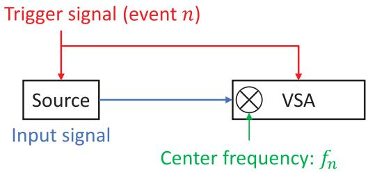
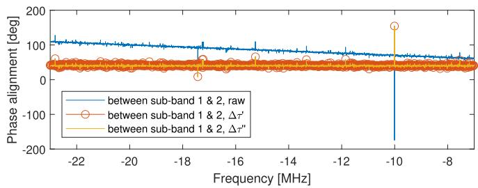
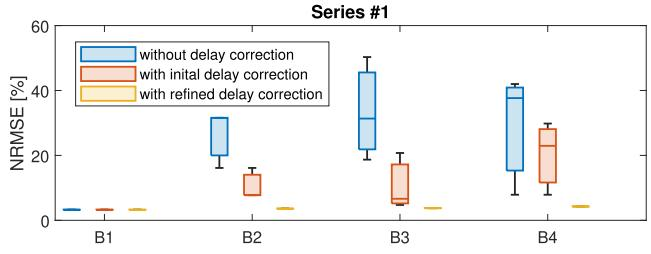
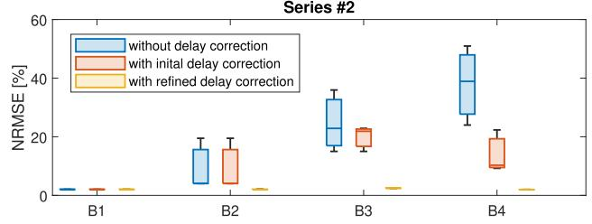
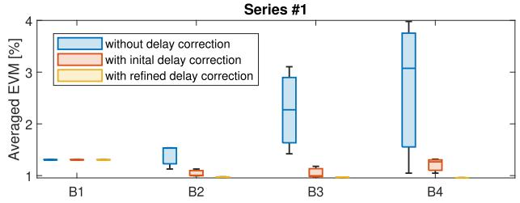

# On Band Stitching for Wideband Vector Measurements With Vector Signal Analyzers

## 📋 基本信息

| 字段 | 内容 |
|------|------|
| **作者** | Yilin Ji, Jesper Ødum Nielsen, Wei Fan |
| **期刊/会议** | IEEE Trans. on Instrumentation and Measurement（推测） |
| **年份** | 2022 |
| **DOI** | 待补充 |
| **链接** | 待补充 |
| **标签** | #信道测量 #VSA #带宽拼接 #EVM #宽带测量 |

## 🎯 核心问题

> 5G NR 信号带宽不断增加（FR2 单载波可达 400 MHz），但现有商用 VSA 的分析带宽往往不足以一次性捕获完整宽带信号。带宽拼接（Band Stitching）可在不更换硬件的前提下扩展测量带宽——把宽带信号切成几个有重叠的子带分别测量，再在频域拼接还原。然而不同子带之间存在定时、幅度和初始相位偏差，现有方法（触发 + 互相关）无法达到足够的定时估计精度。**本文提出一种两步延迟估计方法（粗互相关 + 精相位方差最小化），实现亚采样周期级的时间对齐，从而显著改善拼接后的 NRMSE 和 EVM。**

## 🧠 方法/模型

### 🔑 关键物理直觉

在正式讲方法之前，先理解一个核心物理事实：

**时间延迟在频域中不是常数相位偏移，而是随频率线性变化的相位斜率。**

假设真实信号为 $x(t)$，某个子带因为触发延迟或多了一条不等长的采样路径，整体滞后了 $\tau$。在频域中：

$$
X(f) \cdot e^{-j 2\pi f \tau}
$$

这意味着：频率越高，相位旋转越厉害。如果两个子带之间存在相对时间偏差 $\Delta\tau$，它们在重叠频段的相位差就不是常数：

$$
\Delta\theta(f) \approx -2\pi f \cdot \Delta\tau + \Delta\phi
$$

其中：
- **$-2\pi f \cdot \Delta\tau$**：由时间错位造成的线性相位斜率（频率依赖）
- **$\Delta\phi$**：初始相位偏移（频率无关的常数）

这就是为什么只校正一个固定相位是不够的——必须先消掉相位斜率（即估计并补偿 $\Delta\tau$），剩下的常数相位才能被单独校正。

**整篇论文的方法论逻辑链**：
> 时间偏差 → 频域线性相位斜率  
> 相位偏差 → 频域常数相位偏移  
> 幅度偏差 → 频域幅度比例变化  
>  
> 因此：先估计时间延迟（消除斜率）→ 再估计幅度和初始相位（消除常数偏差）→ 最后频域拼接

### 核心思路（分步详解）

#### Step 1：粗延迟估计（频域互相关）

直觉：在不同候选时间偏移下，看两个子带的重叠频谱能不能"对齐得最像"。

$$
\Delta\tau' = \arg\max_{\tau'} \left| \sum_{f \in f_{\text{overlap}}} S_1(f) S_2^*(f) e^{j 2\pi f \tau'} \right| \tag{3}
$$

物理含义：
- $S_1(f)$ 和 $S_2^*(f)$ 相乘：在频域做"相干叠加"。如果两个频谱在重叠频段形状相似，相干叠加会给出一个大值
- $e^{j2\pi f \tau'}$：尝试补偿一个候选延迟。如果 $\tau'$ 恰好等于真实延迟 $\Delta\tau$，那么补偿后两个频谱相位一致、相干叠加结果最大
- 故 $\arg\max$ 找到的就是最可能的延迟值

**局限**：互相关的分辨率受 FFT 网格和采样率限制，通常只能达到"一个采样周期左右"的精度，无法做到亚采样级。

#### Step 2：精延迟估计（相位方差最小化）

这是论文真正的核心创新。它利用了一个物理事实：

> 如果时间延迟已经校正正确，那么两个子带在重叠频段的相位差应该接近一个常数，不应该随频率明显变化。

具体操作：
1. 用粗估计 $\Delta\tau'$ 先做一次校正
2. 在粗估计附近的小范围内（只需几个延迟分辨率 $1/B_{\text{in}}$），搜索一个微小修正量 $\tau''$
3. 对每个候选修正量，计算两个子带比值 $\frac{\bar{S}_1(f)}{\bar{S}_2(f; \Delta\tau' + \tau'')}$ 在重叠频段的**相位角标准差**
4. 选择让这个标准差最小的 $\tau''$

$$
\Delta\tau'' = \underset{\tau''}{\arg\min}\ \sigma\left(\angle \frac{\bar{S}_1(f)}{\bar{S}_2(f; \Delta\tau' + \tau'')}\right) \tag{6}
$$

最终延迟估计：$\Delta\tau = \Delta\tau' + \Delta\tau''$

**为什么这能实现亚采样精度？** 因为相位是连续的——即使时间偏差小于一个采样周期，它仍然会在相位上留下可观测的斜率。通过最小化相位方差，我们相当于在"相位域"而不是"采样域"做精确定位。

**直观对比**：

| 延迟校正状态 | 重叠频段相位差表现 |
|-------------|-------------------|
| 未校正 | 相位差随频率快速变化（明显斜率），如 10°→40°→80° |
| 仅粗校正 | 斜率减小但仍可观测 |
| 粗+精校正 | 相位差接近常数，如 45°→46°→44°（只剩常数 $\Delta\phi$ 待校） |

#### Step 3：幅度和相位校正

延迟校正后，剩下的常数相位偏移和幅度差异可以简单估计：

$$
\Delta\alpha = \left| \frac{1}{N_f} \sum_f \frac{\bar{S}_1(f)}{\bar{S}_2(f; \Delta\tau)} \right| \tag{7}
$$

$$
\Delta\phi = \angle\left( \frac{1}{N_f} \sum_f \frac{\bar{S}_1(f)}{\bar{S}_2(f; \Delta\tau)} \right) \tag{8}
$$

论文发现 $\Delta\alpha$ 通常接近 1（幅度偏差可忽略），但 $\Delta\phi$ 在不同重复测量之间变化很大（39.9° ~ 141.1°），说明**每次测量都必须重新校正，不能假设相位偏差是固定的**。

#### Step 4：频域拼接

$$
\bar{Y}(f) = \begin{cases} 
\bar{S}_1(f), & -\frac{1}{2}B_{\text{in}} \leq f < -\frac{1}{2}B_{\text{overlap}} \\
\bar{S}_1(f), & |f| \leq \frac{1}{2}B_{\text{overlap}} \\
\bar{S}_2(f; \Delta\tau) \cdot \Delta\alpha e^{j\Delta\phi}, & \frac{1}{2}B_{\text{overlap}} < f \leq \frac{1}{2}B_{\text{in}}
\end{cases} \tag{9}
$$

关键：第二个子带必须先做"时间+幅度+相位"三重校正（即乘以 $\Delta\alpha e^{j\Delta\phi}$），再与第一个子带拼接。否则拼接边界会出现幅度跳变和相位不连续。

### 系统框图

- **序列式（Sequential）**：单台 VSA，N 次触发事件，每次调谐到不同子带中心频率。成本低但耗时长，无法处理非重复信号
- **并行式（Parallel）**：N 台 VSA 同时采集。速度快但成本高，且不同 VSA 间的时钟/触发/链路差异更大

### 关键设计：重叠带宽的必要性

为什么相邻子带之间必须有重叠？因为**没有重叠区域，你就无法知道两个子带之间到底差了多少时间、幅度和相位**。重叠频段实际上充当了校准区——所有偏差估计都在这里完成。

重叠带宽的大小是一个工程权衡：太窄则校准信息不足（估计方差大），太宽则浪费有效带宽。

## 📐 关键公式

核心公式为 (3) 粗延迟、(6) 精延迟、(7) 幅度校正、(8) 相位校正、(9) 拼接、(10) NRMSE（详见结果节）。

## 💻 实验设置

论文用两组实验验证，分别在 1 GHz（Series #1）和 28 GHz（Series #2，外混频）下进行。

**信号**：5G NR 标准测试信号 NR-FR1-TM3.1a —— OFDM 256QAM，100 MHz 带宽，30 kHz 子载波间隔，10 ms 帧。

**仪器**：信号源 R&S SMBV100B（retrigger 模式），VSA R&S FSW67，两者锁定同一 10 MHz 参考频率。记录时长 60 ms，每组重复 3 次。

**拼接方案**（B1 是基准，B2-B4 用较窄带宽测量再拼接）：

| 方案 | 含义 | 采样率 | 分析带宽 | 子带数 |
|---|---|---|---|---|
| B1 | 全带宽参考测量 | 122.88 MHz | 98.3 MHz | 1 |
| B2 | 2 子带拼接 | 100 MHz | 80 MHz | 2 |
| B3 | 3 子带拼接 | 62.5 MHz | 50 MHz | 3 |
| B4 | 4 子带拼接 | 50 MHz | 40 MHz | 4 |

所有拼接方案的相邻子带重叠带宽统一为 20 MHz。

**评估指标**：NRMSE 和 EVM（按 3GPP TS 38.141-1 标准）。

## 📊 主要结果

### 相位对齐效果

- 无延迟校正时（蓝色）：相位差有明显的频率依赖性斜率
- 仅粗校正后（红色）：斜率大幅减小，但仍可见残留
- 粗+精校正后（黄色）：相位接近平坦，只剩常数 $\Delta\phi$ 待校

这直接印证了"先消斜率、再校常数"的物理逻辑。

### NRMSE 结果（最核心的定量支撑）

**NRMSE（归一化均方根误差）**衡量拼接频谱与参考频谱的偏差：

$$
\text{NRMSE} = \frac{\sqrt{\text{mean}(|a(f) - b(f)|^2)}}{\sqrt{\text{mean}(|b(f)|^2)}} \times 100\% \tag{10}
$$

其中 $a(f)$ = 拼接后的频谱，$b(f)$ = 参考频谱。NRMSE 越小，拼接结果越接近参考测量。

三层对比揭示了一个干净的趋势：

| 延迟校正程度 | NRMSE 表现                    | 原因                           |
| ------ | --------------------------- | ---------------------------- |
| 无延迟校正  | 散布随子带数增加而显著增大（B2→B4 箱体越来越宽） | 每增加一个子带，就多引入一次未校准的定时偏差       |
| 仅粗校正   | 散布缩小但仍不够稳定                  | 粗互相关只能到采样周期级精度，残留亚采样误差仍有相位斜率 |
| 粗+精校正  | 箱体收敛至接近 B1 全带宽参考水平          | 精炼将延迟精度推到亚采样级，相位斜率基本消除       |

典型数值：Series #1 B3 拼接 NRMSE = 3.78%（vs B1 参考 3.32%）；Series #2 差异更小（~0.5%）。

**结论：两步延迟估计确实将拼接从"能拼起来"提升到了"拼得准"。**

### EVM 结果（含反直觉解读）

**EVM（误差矢量幅度）**衡量接收星座点与理想星座点之间的偏差，是通信发射机测试的核心指标。

**反直觉现象**：Series #1 中，拼接方案 B2-B4 的 EVM（~0.96%）反而优于全带宽参考 B1（1.31%）。

这不是拼接"神奇地提升了信号质量"，而是**仪器噪声底变化**造成的：
- VSA 在 100 MHz 采样率附近有一个内部切换点，切换后噪声底升高约 2 dB
- B1 全带宽测量使用 122.88 MHz 高采样率，落在高噪声区域
- B2-B4 拼接使用 50-100 MHz 低采样率，落在低噪声区域

**启示**：EVM 不只反映算法好坏，也受仪器采样率、噪声底、外混频器等硬件因素影响。判断拼接质量时应结合 NRMSE 等多指标综合评估。

对于 Series #2（28 GHz，外混频），外混频的额外噪声掩盖了采样率切换的噪声底差异，因此拼接方案与 B1 的 EVM 差异不显著。

### 两步法的精度

精炼估计 $\Delta\tau''$ 达到 **0.03~0.34** $\delta_\tau$（$\delta_\tau = 1/122.88\ \mu s \approx 8.14\ ns$），即**亚纳秒级定时精度**。

这带来了两个实用好处：
1. 精炼搜索范围被粗估计大幅压缩（仅几个 $\delta_\tau$ 内搜索），计算量可控
2. 拼接后的 NRMSE 和 EVM 与完整带宽参考测量几乎不可区分

## 📝 我的评价

**优点：**

- 方法简洁且物理直觉清晰：粗互相关定位 → 精相位对齐细化，先粗后细的思路非常工程化
- 精炼步骤利用"正确延迟 → 相位差为常数"这一物理事实，实现亚采样周期级精度，构思巧妙
- 1 GHz + 28 GHz 两组实验，B1-B4 四种拼接方案，3 次重复，验证充分
- 零硬件成本，纯后处理实现，可直接应用于现有 VSA 设备
- 发现并解释了 VSA 采样率-噪声底关联现象，对后续测量规划有指导意义

**不足：**

- 仅验证序列式，并行式待验证：并行式（多 VSA 同时采集）的定时偏差更大且更复杂——涉及参考时钟不一致、本振相位差异、接收链路群时延差异等多重同步问题，方法效果待验证。对信道测量尤其关键：无线信道是时变的，序列式无法处理动态场景
- 缺乏系统的不确定度分析：论文证明了方法有效，但未系统讨论 SNR 对估计精度的影响、重叠带宽大小对估计精度的敏感性、子带数增加后的误差传播、频响不平坦时的鲁棒性等。这些正是可拓展的科研方向
- 信号适用性边界未充分讨论：互相关粗估计依赖信号的时域正交性（伪噪声序列等），对频谱稀疏、深衰落严重或相位噪声大的信号，相位方差最小化可能不稳定
- 精炼步骤的计算开销：单次精炼搜索需 O(M Nt log Nt)，子带数较多时可能成为计算瓶颈

**与现有工作的关系：**

- 是对 [7]-[9] 中基于触发+互相关的定时校准方法的直接改进，将精度从采样周期级提升到亚采样级
- 与 [10] 的多正弦法互补——本文支持任意宽带信号（不限定信号类型）
- 为 VSA 带宽受限场景下的 5G NR 发射机一致性测试（TS 38.141-1）提供可行方案

## 🔗 与通信信道测量的关联

这篇论文虽然表面上是 VSA 仪器测量技术，但其核心思想与宽带信道测量高度相关。

### 问题类比

| | VSA 带宽拼接 | 宽带信道测量 |
|---|---|---|
| 遇到什么困难 | 单台仪器分析带宽不够 | 单次测量带宽不够 |
| 怎么办 | 分段测、频域拼 | 扫频或分段测、拼接信道响应 |
| 偏差类型 | 定时/幅度/相位偏差 | 频段间幅度/相位不连续 |
| 不校准的后果 | EVM 恶化、星座发散 | CIR 虚假多径、时延扩展偏大、PDP 旁瓣升高 |

### 可迁移思想

论文的核心方法论——**只要相邻频段有重叠，就可以利用重叠区域估计相对偏差并校准**——可以迁移到：

- **宽带信道探测（Channel Sounding）**：扫频测量中不同频段间存在相位不连续，用重叠频段做相位对齐
- **毫米波/太赫兹多段测量**：频率越高、带宽越大，分段测量越普遍，拼接校准需求越强
- **多仪器联合测量**：不同接收机之间的同步误差与子带偏差本质相同
- **信道重构（Channel Reconstruction）**：频域相位误差会导致时域 CIR 主径偏移、虚假径、PDP 失真
- **信道模拟器带宽扩展**：与 VSA 问题完全对称——用多台较窄带宽模拟器拼接模拟宽带信道

### 论文的迁移局限性

需要注意，论文主要验证的是**序列式 + 可重复信号**。无线信道是时变的，每次测量不完全相同——直接将序列式方法用于动态信道测量会引入额外的信道变化误差。并行式（多接收机同时采集）更适合信道测量，但并行式的校准更复杂，论文未充分验证。

## 🔗 相关论文

- [[Sun-TAP-PFS-SCF-RSD-Optimization-2025]]（同组 Wei Fan，OTA 测试方向）
- Bas-COMM-RT-UWB-Channel-Sounder-2019（信道探测带宽扩展 [11]）
- Fan-TAP-Flexible-mmWave-Channel-Emulator-2018（信道模拟带宽拼接 [12]）

## 💡 一句话总结

**本文提出了一种用于 VSA 宽带矢量测量的带宽拼接方法，通过「互相关粗估计 + 重叠频段相位方差最小化精估计」两步法实现亚采样级时间对齐，将拼接从"能拼起来"提升到"拼得准"。**

更短：**用重叠频段，把不同子带的时间斜率、幅度比例和相位偏移校正掉。**

核心方法论——只要有重叠频段就能估计并校准偏差——可迁移到宽带信道探测、扫频拼接、毫米波多段测量等场景。这篇论文对通信信道测量最有价值的不是 EVM 本身，而是 **跨子带相位连续性校准思想**。
