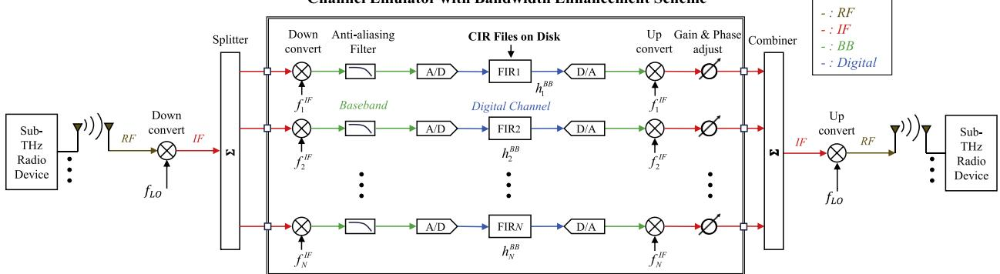
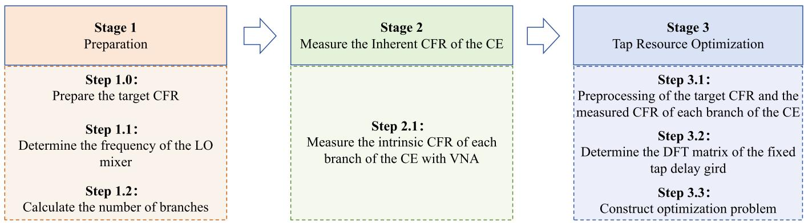
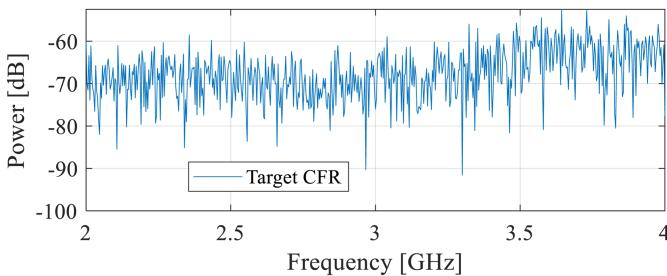
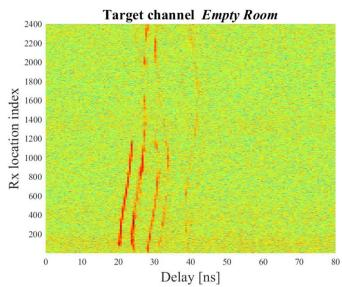
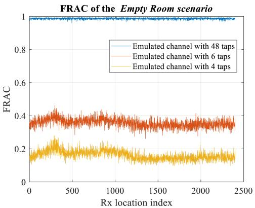

# Subterahertz Radio Channel Emulation With Band-Stitching Scheme: Framework, Resource Optimization, and Validation

## 📋 基本信息

| 字段 | 内容 |
|------|------|
| **作者** | Chunhui Li, Zhiqiang Yuan, Wei Fan |
| **期刊/会议** | IEEE Transactions on Antennas and Propagation（推测） |
| **年份** | 2025 |
| **DOI** | 待补充 |
| **链接** | 待补充 |
| **标签** | #信道模拟 #sub-THz #带宽拼接 #CE #抽头优化 #6G |

## 🎯 核心问题

> sub-THz（100–300 GHz）是 6G 的关键候选频段，但现有商用信道仿真器（CE）带宽受限于 sub-6 GHz 设计，无法直接覆盖 sub-THz 的宽带需求。带宽拼接（band-stitching）提供了扩展可能——将宽带信号分配到 N 个子信道分别处理再拼接——但这引入了三个新挑战：① 抽头延迟必须对齐到 CE 的固定延迟网格（舍入误差）；② 各子信道的抽头资源（FPGA DSP 单元）有限；③ 各子信道的频响（CFR）不一致需要校准。**本文提出一个完整的 sub-THz 信道仿真框架，联合解决抽头延迟对齐、抽头资源优化和子信道校准三大问题，并通过 100 GHz 和 300 GHz 实测数据验证。**

## 🔬 现有研究问题与本文方案对比

| 现有方法 | 存在的问题 | 本文解决方案 | 本文优势 |
|----------|-----------|-------------|----------|
| 标准 TDL 信道仿真 | 带宽限于 sub-6 GHz，无法覆盖 sub-THz 宽带 | N 路子信道带宽拼接 + 统一优化框架 | 将商用 CE 的可用带宽扩展至 sub-THz |
| 单独处理抽头延迟对齐 [24] | 仅考虑延迟舍入，未联合优化抽头资源 | 利用 CE 的 DoF（衰减+相位调整）补偿舍入误差 | 延迟对齐 + 资源优化联合求解 |
| 单独处理抽头稀疏化 [23][24] | 未考虑子信道 CFR 不一致 | MMSE 权重 + IP 迭代剪枝算法 | 子信道校准 + 抽头选择联合优化 |
| [25] 的初步 sub-THz CE 方案 | 缺少完整技术细节 | 提供从预处理到优化到验证的全流程 | 首次给出 sub-THz CE 的完整可复现框架 |

## 🧠 方法/模型

### 🔑 关键物理直觉

在进入框架之前，先理解 sub-THz 信道仿真面临的核心矛盾：

**商用 CE 是"固定网格"设备**。它的抽头延迟被锁定在一个等间隔的离散网格上（如 20 ns 间隔），而现实信道的多径延迟是连续值。当目标信道延迟落在网格之间时，CE 会将其"四舍五入"到最近的网格点——这引入了延迟舍入误差。

在 sub-6 GHz 频段，这个误差可能无关紧要（因为 20 ns 远小于符号周期）。但在 sub-THz 频段，目标是仿真 GHz 级带宽的信道，延迟精度要求达到 ns 甚至亚 ns 级——网格舍入误差将导致仿真 CFR 在幅度和相位上出现不可忽略的失真。

**论文的核心洞察**：CE 虽然不能改变延迟网格的位置，但 CE 用户可以对每个抽头独立调整复权重（衰减 + 相位旋转）。这意味着**可以通过优化抽头权重来补偿延迟舍入的影响**——这本质上是一个在有限抽头资源下的 FIR 滤波器设计问题。

更妙的是，sub-THz 信道天然稀疏（高频传播损耗大、波束赋形进一步减少有效多径），意味着**只需要少数几个抽头（4–6 个）就能准确仿真 sub-THz 信道**，恰好缓解了抽头资源紧张的矛盾。

### 核心思路（分步详解）

整篇论文的方法论逻辑链：

> 带宽不够 → N 个子信道拼接  
> 延迟网格舍入 → 用抽头复权重优化补偿  
> 抽头资源有限 → 利用 sub-THz 信道稀疏性，IP 迭代剪枝选最优抽头位置  
> 子信道 CFR 不一致 → 实测校准 + MMSE 求解

#### Stage 1：准备阶段

**Step 1.0**：准备目标 CFR（信道频响）。如果只有 CIR，通过傅里叶变换得到 CFR。

**Step 1.1**：确定本振频率 $f_{\mathrm{LO}} = f_{\mathrm{RF}} - f_{\mathrm{IF}}$。这个简单公式背后是一个重要的架构认知：sub-THz 射频信号先下变频到中频（IF，如 3 GHz），在 IF 频段由商用 CE 处理，再上变频回 sub-THz——整个框架建立在"中频仿真 + 变频扩展"的架构之上。

**Step 1.2**：计算所需子信道数 N。核心约束是 N 个子信道拼接后的有效平坦带宽必须超过目标信道带宽：

$$\left(\frac{1}{T} \cdot N - \frac{\beta}{T}\right) \geq B^t$$

其中 $1/T$ 是子信道符号率，$\beta$ 是升余弦滚降因子。例如论文中每个子信道有效带宽 100 MHz，仿真 2 GHz 带宽信道需要 22 个子信道。

#### Stage 2：测量 CE 的固有 CFR

每路子信道的频响不是理想平坦的，必须先实测。具体做法：CE 设为 bypass 模式，用 VNA 扫频测量每路子信道的系统响应 $\mathbf{g}_n^{\mathrm{BB}}$。这一步的数据将用于后续 MMSE 求解中的噪声底约束。

#### Stage 3：抽头资源优化（核心贡献）

这是论文最核心的部分。问题可以表述为：在固定延迟网格上，为 N 个子信道各选择有限个抽头并优化其复权重，使得拼接后的仿真 CFR 尽可能逼近目标 CFR。

**Step 3.1**：预处理。将目标 CFR 和实测子信道 CFR 统一迁移到基带（BB）频域，为后续统一优化做准备。

**Step 3.2-3.3**：建立优化问题。原始问题是一个联合优化 N 个子信道抽头权重的大规模非凸问题（式 5）。论文的关键简化是**按子信道分解**：利用理想升余弦频谱 $\mathbf{g}^{\mathrm{RC}}$ 作为参考，将目标 CFR 按子信道频段"切分"，每个子信道独立优化：

$$\min_{\mathbf{w}_n} \left\| (\mathbf{D}^{\mathrm{BB}} \cdot \mathbf{w}_n) \circ \mathbf{g}_n^{\mathrm{BB}} - \mathbf{h}_{f,t}^{\mathrm{BB}} \circ \mathbf{g}_n^{\mathrm{RC}} \right\|_2^2, \quad \text{s.t. } \|\mathbf{w}_n\|_0 \leq N_{n,\mathrm{tap}}^{\mathrm{select}}$$

大白话翻译：对第 n 个子信道，在固定延迟网格的 $\mathbf{D}^{\mathrm{BB}}$ 矩阵上选择最多 $N_{n,\mathrm{tap}}^{\mathrm{select}}$ 个抽头位置，优化它们的复权重 $\mathbf{w}_n$，使仿真 CFR（抽头权重 × 网格 DFT × 实测子信道 CFR）逼近目标 CFR。

**这个分解的巧妙之处**：原本 N 个子信道互相耦合（通过拼接后的总 CFR 影响优化目标），分解后每个子信道独立优化，问题规模从 $O(N \cdot N_{\mathrm{tap}})$ 降为 $N \times O(N_{\mathrm{tap}})$。

**Step 3.4**：IP 迭代剪枝算法求解。当抽头位置确定后，问题退化为凸优化（式 8），可用 MMSE 闭式解：

$$\mathbf{w}_n' = \left(\mathbf{A}^H \mathbf{A} + \sigma^2 \mathbf{I}\right)^{-1} \mathbf{A}^H \left(\mathbf{h}_{f,t}^{\mathrm{BB}} \circ \mathbf{g}_n^{\mathrm{RC}}\right)$$

$\sigma^2$ 来自 Stage 2 实测的噪声底——这是将测量信息融入优化的重要设计。

IP 算法的逻辑：从全部 $N_{\mathrm{tap}}$ 个候选抽头开始，每次迭代计算 MMSE 权重后剪掉权重幅值最小的 $m_k$ 个抽头，重复直到只剩 $N_{n,\mathrm{tap}}^{\mathrm{select}}$ 个。**直觉**：每次删除"贡献最小"的抽头，逐步逼近最优的稀疏抽头组合。

### 系统框图

关键架构：sub-THz RF 信号 → 下变频至 IF → N 路并行 CE 子信道（带宽拼接）→ 上变频回 sub-THz。

三阶段流程：准备 → 测量 CE 固有 CFR → 抽头资源优化。注意 Stage 2 只需执行一次（针对固定 CE 硬件配置），Stage 3 对每个目标信道场景执行。

### 关键设计权衡

**子信道数 vs 抽头数**：sub-THz 频段需要的子信道数多（22 个 vs 低频段典型的 2-4 个），但因为 sub-THz 信道稀疏，每个子信道需要的抽头数少（4-6 个 vs 低频段典型的 20+ 个）。这是一种天然的复杂度平衡。

## 📐 关键公式

核心公式为：目标 CIR（式 1）、仿真 CIR 含舍入（式 2）、子信道数条件（式 4）、联合优化问题（式 5）、升余弦参考频谱（式 6）、分解后的子信道优化（式 7）、MMSE 闭式解（式 9）、FRAC 评价指标（式 10，详见结果节）。

## 💻 实验设置

论文使用两组真实 sub-THz 信道测量数据（100 GHz 和 300 GHz）进行数值仿真验证。

**场景**：两个实测场景——① 空房间（100 GHz，全向天线，金属板遮挡 LOS）；② 宽敞大厅（300 GHz，喇叭天线，高增益）。前者信噪比低、多径丰富，后者信噪比高、信道稀疏。

**信号**：VNA 信道探测器，扫频 99–101 GHz（空房间，601 频点）和 299–301 GHz（大厅，4001 频点），相位补偿架构保证相干测量 [31]。

**仪器配置**：仿真 CE 的子信道有效带宽 100 MHz（升余弦滚降 $\beta$），拼接 22 路子信道覆盖 2 GHz 目标带宽。IF 设为 3 GHz，LO 分别 97 GHz 和 297 GHz。子信道非理想特性按实测数据模拟（±0.64 dB 幅度变化，±23.58° 相位变化）。

| 方案 | 含义 | 每子信道抽头数 |
|------|------|--------------|
| 48-tap | 几乎全抽头（理论上限参考） | 48 |
| 6-tap | 中等稀疏（实用配置） | 6 |
| 4-tap | 极限稀疏（低成本配置） | 4 |

**评估指标**：FRAC（Frequency Response Assurance Criterion）——衡量仿真 CFR 与目标 CFR 的谱形相似度，$\rho \in [0,1]$，$\rho = 1$ 表示完全相关。

## 📊 主要结果

### CFR 拼接示例

22 个升余弦子信道在 IF（2–4 GHz）均匀排列，拼接后的有效平坦带宽覆盖 2 GHz 目标带宽。这直观展示了带宽拼接策略的可行性。

### 空房间场景 CIR 仿真结果（100 GHz）

三层解读：

- **观察**：48-tap 仿真 CIR 与目标 CIR 几乎完美匹配，空间非平稳特性（金属板遮挡 LOS 导致的 CIR 突变）被准确复现。6-tap 仿真也能成功复现主要多径，仅丢失部分低功率散射径。4-tap 在 LOS 被遮挡的 Rx 位置表现明显下降。

- **原因**：空房间场景使用全向天线，多径较丰富，噪声底高。4 个抽头不足以覆盖所有显著路径，尤其是在 LOS 遮挡、有效多径数量实际增多的区域。6 个抽头是一个较好的折中。

- **结论**：对于 100 GHz 全向天线场景，6-tap 配置可实用化。

### FRAC 定量分析

**FRAC（频响保证准则）**衡量仿真 CFR $\mathbf{h}_{f,e}$ 与目标 CFR $\mathbf{h}_{f,t}$ 的谱形相似度：

$$\rho = \frac{\left| \mathbf{h}_{f,e}^{\mathrm{H}} \mathbf{h}_{f,t} \right|^2}{\left(\mathbf{h}_{f,e}^{\mathrm{H}} \mathbf{h}_{f,e}\right) \left(\mathbf{h}_{f,t}^{\mathrm{H}} \mathbf{h}_{f,t}\right)}$$

其中 $\rho \in [0,1]$，$\rho = 1$ 表示仿真 CFR 与目标 CFR 完全相关。FRAC 不同于 NRMSE——它衡量的是谱形相似度而非逐点误差，对于通信系统性能评估（取决于信道谱形而非逐点匹配）更有参考价值。

- **空房间场景**：48-tap FRAC 接近 1（几乎完美仿真）；6-tap 和 4-tap 的 FRAC 降至 0.5 以下——因为全向天线 + 低 SNR 条件下信道不够稀疏，4-6 个抽头不足
- **大厅场景**（高增益喇叭天线，300 GHz）：48-tap、6-tap、4-tap 的 FRAC 均在 0.7 以上——因为高方向性天线使信道极度稀疏，仅少数主导路径即可准确仿真

**这是一个有实用指导意义的发现**：sub-THz 通信系统通常使用高增益波束赋形天线，信道天然稀疏。因此即使在极有限的抽头资源（4-tap）下，所提框架也能实现高质量的 sub-THz 信道仿真。

### 子信道数 vs 抽头数的 trade-off 结论

| 频段 | 子信道数需求 | 单子信道抽头需求 | 净效果 |
|------|------------|----------------|--------|
| sub-6 GHz（传统） | 少（1-2 个） | 多（20+ taps） | 抽头资源紧张 |
| sub-THz（本文） | 多（22 个） | 少（4-6 taps） | **复杂度天然平衡** |

## 📝 我的评价

**优点：**

- **框架完整且可复现**：从目标 CFR 预处理、CE 固有 CFR 测量、抽头优化到 CFR 拼接，给出了一个完整的工程流程。相比 [25] 的初步方案，本文提供了所有技术细节，后续研究者可以直接复现
- **问题分解巧妙**：将 N 个子信道的联合优化分解为 N 个独立子问题，利用理想升余弦频谱作为参考。这个分解不仅降低了计算复杂度，还使得每个子信道可以独立配置（不同抽头数），增强了框架的灵活性
- **IP 迭代剪枝算法实用**：从全抽头开始逐步删除最小贡献者，避免了组合爆炸（从 $N_{\mathrm{tap}}$ 个位置中选 $N_{\mathrm{select}}$ 个的组合数）。MMSE 闭式解使每次迭代的计算量很小。这种方法在工程上比稀疏优化（如 OMP）更简单且效果可靠
- **双场景、双频段验证**：100 GHz 全向天线（低 SNR、多径丰富）和 300 GHz 喇叭天线（高 SNR、信道稀疏）两个极端场景，覆盖了 sub-THz 应用的典型范围
- **将实测信息纳入优化**：Stage 2 测量 CE 的固有 CFR 和噪声底，并作为 $\sigma^2$ 参数嵌入 MMSE 求解——这是将硬件非理想性转化为优化先验信息的优秀实践

**不足：**

- **缺少实际 CE 硬件验证**：全文为 MATLAB 数值仿真（虽使用实测信道数据和模拟的非理想子信道 CFR）。论文承认"future work may involve experimental validation using real CEs"，说明当前仍处于仿真阶段。实际 CE 中的非线性、相位噪声、I/Q 不平衡等因素可能引入额外误差
- **IP 剪枝算法的全局最优性无保证**：每次迭代剪除当前权重最小的抽头是贪心策略，可能陷入局部最优。论文未讨论剪枝步长 $m_k$ 的选择依据，也未与其他稀疏选择算法（如 OMP、LASSO）进行对比
- **对动态信道的适用性未讨论**：所提框架假设目标 CFR 是静态的（实测快照）。对于移动场景中的时变信道，抽头优化需要在线更新，IP 算法的迭代开销是否可接受需要评估
- **仅 SISO 验证**：论文声明"MIMO 扩展是线性且直接的"，但 MIMO 场景中不同天线对之间的信道联合仿真、以及天线耦合对子信道 CFR 的影响未涉及

**与现有工作的关系：**

- 是对 [25]（Dynamic sub-THz radio channel emulation）的完整技术补充——给出了框架的所有细节和优化算法
- 与 [23]（Band-stitching and digital predistortion）共享带宽拼接思路，但将应用从 VSA 测量迁移到 CE 信道仿真，且额外处理了抽头延迟对齐和资源优化问题
- IP 剪枝思路与 [24] 的 OMP 抽头选择互补——OMP 是向前选择（逐步增加抽头），IP 是向后删除（逐步减少抽头），在抽头数远小于候选数时 IP 可能更高效

## 🔗 与通信信道测量的关联

这篇论文虽然是信道仿真方向，但其核心方法论与信道测量高度相关。

### 问题类比

| | 本文：sub-THz CE 带宽拼接 | 信道测量 |
|---|---|---|
| 困难 | 单台 CE 带宽不足以覆盖 sub-THz 宽带 | 单次测量带宽不足以分辨多径 |
| 方案 | N 路子信道频域拼接 | 扫频/多段测量拼接 |
| 偏差来源 | 子信道 CFR 不一致 + 抽头延迟舍入 | 频段间相位不连续 + 仪器频响不平坦 |
| 不处理的后果 | 仿真 CFR 失真，系统测试结果不可靠 | CIR 虚假径、延迟扩展估计偏差、PDP 畸变 |
| 校准核心 | 实测子信道 CFR + MMSE 补偿 | 背靠背校准 + 相位对齐 |

### 可迁移思想

- **"分解→独立优化→拼接"的框架**：将宽带问题分解为多个窄带子问题，独立优化后再拼接——这个思路可迁移到宽带信道探测中的分段测量与拼接。特别是利用理想参考频谱（如升余弦）作为优化目标的思想，在信道探测的频域校准中可以直接复用
- **IP 迭代剪枝用于多径选择**：信道测量中同样面临"从大量观测中提取少数有效多径"的问题（如 SAGE 的参数估计）。IP 剪枝的"逐步删除最弱者"策略比 SAGE 的串行干扰消除更简单，可作为快速预处理的备选方案
- **将仪器非理想性纳入优化**：Stage 2 实测 CE 的固有 CFR，并将其作为优化约束——信道探测中的仪器频响校准可以采用同样的思路：先测仪器、再纳入反卷积/估计算法

### 迁移局限

- 本文针对的是 CE（有固定延迟网格的确定性系统），而信道探测面对的是物理传播环境（连续的延迟域、无固定网格），延迟舍入问题在信道探测中不存在
- CE 的抽头优化是"拟合已知目标"，而信道测量是"从观测中估计未知参数"——问题本质不同（回归 vs 估计），IP 剪枝不能直接用于信道参数估计

## 🔗 相关论文

- [[Ji-TAP-Band-Stitching-VSA-2022]]（同组，VSA 带宽拼接，共享频域拼接思路）
- [[Sun-TAP-PFS-SCF-RSD-Optimization-2025]]（同组 Wei Fan，OTA 测试方向）
- Fan-TAP-Flexible-mmWave-Channel-Emulator-2018（mmWave 灵活信道仿真器设计 [22]）
- Ji-OJAP-Band-Stitching-DPD-2022（带宽拼接 + 数字预失真 [23]）
- Zhang-WCL-Dynamic-subTHz-CE-2024（动态 sub-THz 信道仿真初步方案 [25]）

## 💡 一句话总结

**本文提出了一个完整的 sub-THz 信道仿真框架，通过"带宽拼接 + CE 固有 CFR 校准 + IP 迭代剪枝抽头优化"三阶段流程，联合解决了抽头延迟对齐、抽头资源限制和子信道频响不一致三大挑战，在 100 GHz 和 300 GHz 实测数据上验证了仅需 4–6 个抽头即可实现高保真 sub-THz 信道仿真。**

更短：**用带宽拼接突破 CE 带宽上限，用迭代剪枝在稀疏 sub-THz 信道上榨干每个抽头的价值。**

核心方法论——"分解→独立优化→拼接"的宽带问题解决范式——可直接迁移到宽带信道探测的分段测量与拼接。但最有价值的是**将硬件非理想性（CE 固有 CFR、噪声底）作为先验信息嵌入优化框架的思路**，这对所有需要在实际仪器上做高精度信号处理的场景都有参考意义。
