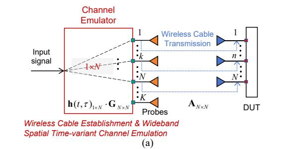
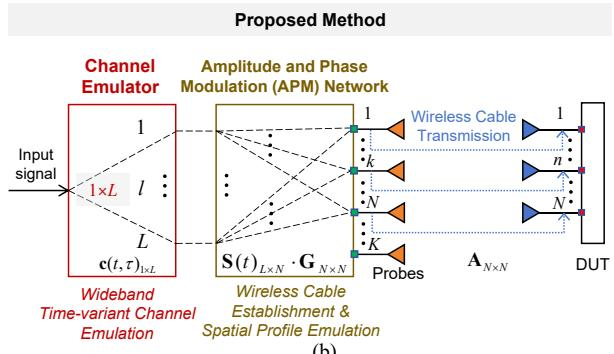
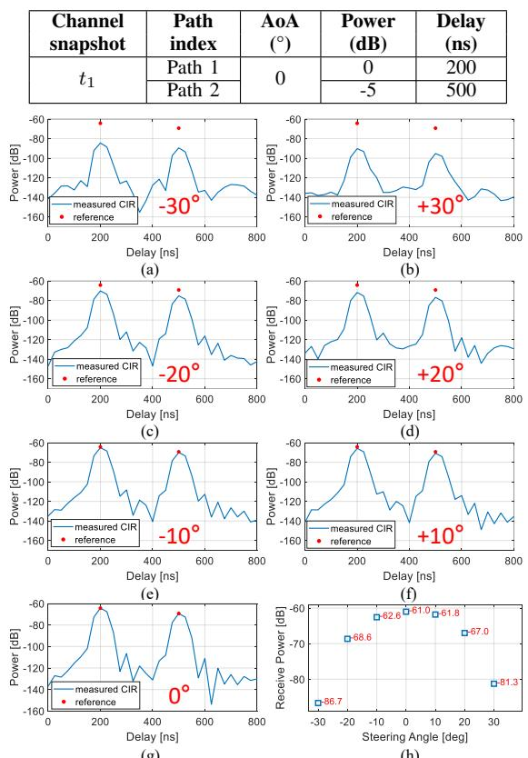
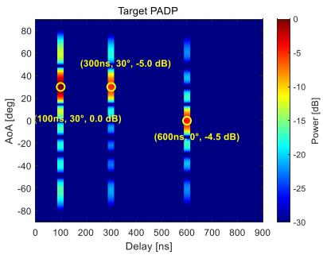
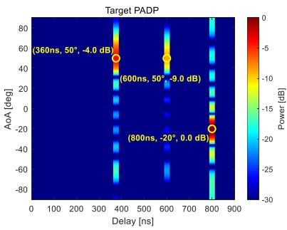

---
tags:
  - OTA测试
  - 无线缆方法
  - 信道仿真
  - 动态信道
  - 稀疏信道
created: 2026-06-16
---

# A Cost-Effective Wireless Cable Solution for Dynamic Sparse Spatial Channel Emulation in Adaptive Antenna Systems Testing

## 📋 基本信息

| 字段 | 内容 |
|------|------|
| **作者** | Chunhui Li, Mengting Li, Yikun Zhao, Fengchun Zhang, Wei Fan (corresponding) |
| **期刊/会议** | IEEE Trans. Antennas Propag.（推测，待确认） |
| **年份** | 2025 |
| **DOI** | 待查 |
| **链接** | 待查 |
| **标签** | #OTA测试 #无线缆 #信道仿真 #APM网络 #动态信道 #稀疏信道 |

## 🎯 核心问题

> 传统无线缆（wireless cable）OTA 测试方法要求 CE 的 RF 端口数 ≥ DUT 天线数 N，在 6G 大规模天线场景下 CE 资源不可承受。本文提出一种低成本方案：利用 APM（幅相调制）网络将无线缆建立和空间映射从 CE 卸载出来，使 CE 只需 L（主导多径数）个 RF 通道，而非 N 个。尤其适合高频段稀疏信道 + 波束赋形空间滤波后 L ≪ N 的场景。

## 🔬 现有研究问题与本文方案对比

| 现有方法 | 存在的问题 | 本文解决方案 | 本文优势 |
|----------|-----------|-------------|----------|
| 传统无线缆方法（RTS 第二阶段） | CE RF 端口数 = DUT 天线数 N，6G 大规模天线时资源不可承受 | APM 网络承担空间映射 + 无线缆建立，CE 只负责 L 条路径的时频响应 | CE RF 端口从 N 降至 L（L ≪ N） |
| 传导测试 | 多天线射频系统集成度高，无测试端口可用 | OTA 方案，不依赖物理测试端口 | 适应无测试端口的集成化 DUT |
| 现有 OTA 方法（MPAC 等） | 动态空间信道仿真需要大量探头和 CE 资源 | 路径域 + 空间域分离处理，APM 网络同步更新空间矩阵 S(t) | 适合评估 DUT 自适应波束赋形跟踪性能 |

## 🧠 方法/模型

### 🔑 关键物理直觉

**核心洞察：** 高频段信道天然稀疏，波束赋形进一步过滤出少数主导路径（L ≪ N）。因此没必要在 CE 里为每根天线复制信道——只需在 CE 里生成 L 条路径的时频响应，把"这些路径落到 N 根天线上各产生什么相位/幅度"这件事交给一个低成本 APM 网络来做。

换句话说：**CE 负责"信道长什么样"（路径的延迟、多普勒、功率），APM 网络负责"信道从哪个方向来"（AoA → 阵列流形映射）。**

### 核心思路（分步详解）

#### Step 1：分离路径域与空间域

直觉：目标信道可以因子分解为"路径的时频行为"×"路径的空间特征"两步，不必耦合处理。

信道向量（N 根天线，L 条路径）：

$$
\mathbf{h}(t, \tau) = \mathbf{c}(t, \tau) \mathbf{S}(t) \tag{2}
$$

其中 $\mathbf{c}(t, \tau) \in \mathbb{C}^{1 \times L}$ 是路径域响应（每条路径的幅度、多普勒、延迟），$\mathbf{S}(t) \in \mathbb{C}^{L \times N}$ 是空间矩阵（每行是一条路径在各天线上的阵列响应）。

含义：**如果把 L × N 矩阵全放在 CE 里处理，需要 N 个 RF 端口。但注意到 S(t) 只依赖 AoA，可以用低成本移相器/衰减器网络来实现。**

#### Step 2：用 APM 网络承担空间映射 + 无线缆

直觉：传统无线缆方法需要先测传输矩阵 A（OTA 探头 → DUT 天线），求逆得 G ≈ A⁻¹ 建"无线缆"。把 G 和 S(t) 合并为 W(t) = S(t) G，一次性加载到 APM 网络。

$$
\tilde{\mathbf{h}}(t, \tau) = \mathbf{c}(t, \tau) \underbrace{\mathbf{S}(t) \mathbf{G}}_{\mathbf{W}(t)} \mathbf{A} \approx \mathbf{c}(t, \tau) \mathbf{S}(t) = \mathbf{h}(t, \tau) \tag{5}
$$

含义：**APM 网络 = 低成本的幅相加权矩阵（L 输入 × N 输出），同时完成了两件事——抵消传输路径（无线缆）和注入目标空间特征。CE 只需 L 路输出，每路对应一条多径路径的时频波形。**

#### Step 3：动态信道逐快照更新

直觉：信道随时间变化 = 每个快照更新参数即可。APM 网络每个快照重新加载 W(tₘ)，CE 同步更新路径域响应。

$$
\xi_l(t_{m+1}) = \xi_l(t_m) + \Delta \xi_{l,m}, \quad \xi \in \{a, \tau, \nu, \theta\} \tag{6}
$$

$$
\mathbf{W}(t_m) = \mathbf{S}(t_m) \mathbf{G} \tag{7}
$$

含义：**动态信道的仿真变成了"每快照刷新一次 APM 权值 + CE 波形"。这天然适合评估 DUT 的自适应波束跟踪——AoA 变了，DUT 得跟着调波束方向。**

### 系统框图

> 图 1：传统无线缆 vs 本文方法。关键区别：CE RF 端口数从 N 降为 L，APM 网络承担了空间映射和无线缆建立。

## 📐 关键公式

| 编号 | 含义 |
|------|------|
| (1) | 宽带时变空间信道模型：N 天线、L 路径的 CIR 表达式 |
| (2) | 信道分解：路径域 c(t,τ) × 空间域 S(t) |
| (4) | ULA 阵列流形：空间响应由 AoA θ_l 决定 |
| (5) | 仿真信道的数学验证：W·A ≈ S，证明等价性 |
| (6)-(8) | 动态信道快照更新：参数递推 + APM 权值刷新 |
| (9) | 频域 CSI 表达式（用于验证 PADP） |
| (13) | 波束赋形接收功率：最大功率出现在波束对准 AoA 时 |
| (17) | PADP 矩阵构建：功率-角度-延迟三维特征 |

## 💻 实验设置

**概述**：两组实验验证——① 静态空间信道（模拟波束赋形 DUT），② 动态空间信道（数字波束赋形 DUT）。均在 3.55 GHz、sub-6 GHz 频段进行原理验证。

**信号**：中心频率 3.55 GHz；实验一 span 400 MHz，实验二 span 80 MHz（2001 频点）

**仪器**：
- CE：Keysight Propsim F32（实验二用 1-in 2-out 配置，80 MHz 带宽）
- APM 网络：实验一 1×4，实验二 2×8 全连接
- 探头/DUT 阵列：1×8 ULA 贴片天线（仅用中心 4 或 8 单元）
- 测量：VNA（矢量网络分析仪）记录 CFR
- DUT 模拟：实验一用可编程移相器 + 合路器模拟模拟波束赋形；实验二用 SP8T 开关模拟数字波束赋形

| 实验 | DUT 类型 | 路径数 | 快照数 | CE 通道数 | 验证方式 |
|------|---------|--------|--------|----------|---------|
| 实验一 | 模拟波束赋形 | 2（同 AoA） | 1（静态） | 1 | 波束扫描 CIR + 功率-角度曲线 |
| 实验二 | 数字波束赋形 | 3（含共享 AoA） | 3（动态） | 2 | 目标 vs 实测 PADP 对比 |

**评估指标**：
- **功率估计误差**：实测路径功率与目标功率之差（dB）
- **角度估计误差**：实测 PADP 峰值对应角度与目标 AoA 的偏差（°）
- **PADP（功率-角度-延迟谱）**：三维可视化对比目标与实测信道特征

## 📊 主要结果

### 结果 1：静态空间信道（模拟波束赋形）

**设置**：2 条路径，同 AoA = 0°，不同延迟（200 ns, 500 ns），功率分别为 0 dB 和 −5 dB。DUT 波束方向从 −30° 到 +30° 扫描。

- **观察**：所有扫描角度下均观测到两条路径（200 ns 和 500 ns），波束对准 0° 时两条路径功率同时达到最大
- **原因**：两条路径共享同一 AoA（0°），波束增益对两条路径同时生效。波束偏离时阵列增益以 sinc-like 弧形衰减——符合 (13) 式的理论预测
- **结论**：**静态多径的功率、延迟和角度被准确复现。模拟波束赋形 DUT 的最大接收功率出现在预设 AoA 方向，验证了空间映射的准确性。**

### 结果 2：动态空间信道（数字波束赋形）

**设置**：3 条路径、3 个快照，每个快照中路径的 AoA、功率、延迟均变化（见表 II）。通过 PADP 对比目标与实测信道。

**PADP** 是功率-角度-延迟三维谱：对每个延迟 bin，在各扫描角度上做数字波束赋形，得到 (17) 式矩阵：

$$
[\mathbf{P}^{\mathrm{PADP}}]_{i, j} = \left| \hat{\mathbf{h}}_{\tau}(\tau_j) \, \mathbf{w}(\theta_i) \right|^2 \tag{17}
$$

- **观察**：实测 PADP 在三个快照下均与目标 PADP 高度一致。最大功率估计误差仅 **0.15 dB**，角度估计误差为 **0.5°**（系统性偏差，所有快照一致）
- **原因（功率准确）**：CE 的路径功率控制精度高，APM 网络的幅度加权线性度好
- **原因（角度 0.5° 偏差）**：APM 网络相位调节精度有限，属于硬件限制导致的系统误差
- **结论**：**三条路径在每个快照的功率、延迟、AoA 均被准确复现。系统误差仅为 0.5°，验证了动态空间信道仿真能力。**

## 📝 我的评价

**优点：**

- **问题动机清晰且现实**：6G 大规模天线下传统无线缆方法 CE 资源爆炸，需求真实存在。L ≪ N 的稀疏性假设有明确的物理基础（高频段 + 波束赋形空间滤波）
- **方案简洁优雅**：无非是把"时频"和"空间"解耦 —— CE 做前者、APM 做后者。APM 网络本身是成熟技术（移相器 + 衰减器阵列），成本低、可扩展
- **实验验证双轨并进**：同时覆盖模拟波束赋形和数字波束赋形两种 DUT 架构，动态快照的 PADP 对比直观可信
- **与 Wei Fan 组以往无线缆工作形成体系**：从传统无线缆（[9]）→ 高阶 MIMO 无线缆（[10]）→ 本文稀疏低成本方案，一条清晰的演进线

**不足：**

- **sub-6 GHz 验证，毫米波未实测**：文中承认受设备限制在 3.55 GHz 测试，声称"原理频率无关"，但毫米波段的硬件非理想性（APM 相位精度、探头耦合）会更严重，缺乏直接证据
- **仅考虑 specular 路径，未涉及 diffuse scattering**：在密集多径场景（如室内 rich scattering）下 L ≈ N，方法退化为传统方案，优势消失。但对标 6G 高频段，这个局限可接受
- **DUT 假设较理想**：ULA 各单元方向图相同、远场假设、忽略互耦。实际 DUT 天线阵列的幅相不一致会影响无线缆矩阵 G 的精度
- **无与现有方法的定量对比**：缺乏与传统无线缆方法、MPAC 方法在同一信道下的精度 / 资源对比表

**与现有工作的关系：**

- 可视为 Wei Fan 组 [9][10] 无线缆方法的"稀疏升级版"，核心改动是将 S(t) 和 G 合并到 APM 网络
- 与 Sun-TAP-PFS-SCF-RSD-Optimization-2025 形成互补：Sun 论文解决 CE 内部 SCF 精度问题（PFS 探头选择 + RSD 权值优化），本文解决 CE 外部架构问题（减少 RF 端口数）

## 🔗 与通信信道测量的关联

### 问题类比

|  | 本文 | 信道测量 |
|---|---|---|
| 困难 | CE RF 端口数随天线数线性增长 | 测量设备通道数有限，高分辨率角度估计需要大量天线/虚拟阵列 |
| 方案 | 利用稀疏性将需求从 N 降为 L | 利用信道稀疏性做压缩感知 / 参数化估计 |
| 偏差 | APM 网络相位精度 → 0.5° 系统角度误差 | 阵列校准误差 → 角度估计偏差 |
| 不校准后果 | 无线缆矩阵 G 不准，仿真信道偏离目标 | 阵列流形不准，角度估计偏移 |

### 可迁移思想

- **"时频与空间解耦"思想可迁移到信道参数估计**：将多维信道估计分解为"路径时频参数估计"+"空间参数估计"，降低联合估计复杂度
- **APM 网络的低成本硬件思路**：类似架构可用于搭建信道测量参考信号发生器——用低速移相器+衰减器实现可控空间特征
- **动态快照逐帧验证方法**：PADP 对比目标 vs 实测的思路，可用于验证信道重构算法的动态跟踪性能

### 迁移局限

- 本文是信道仿真（正向：已知参数 → 生成信道），信道测量是反向问题（观测 → 估计参数），方向不同
- APM 网络假设已知 AoA，而在测量中 AoA 正是待估计的量

## 🔗 相关论文

- [[Sun-TAP-PFS-SCF-RSD-Optimization-2025]] （OTA 测试 — CE 内部 PFS 探头选择与权值优化）
- [[Ji-TAP-Band-Stitching-VSA-2022]] （信道测量 — 宽带频带拼接）
- [[Li-TAP-SubTHz-CE-Band-Stitching-2025]] （信道建模 — sub-THz 信道仿真框架）

## 💡 一句话总结

**本文提出了一种面向自适应天线系统测试的低成本无线缆动态空间信道仿真方法，通过 APM 幅相调制网络将 CE 所需 RF 端口数从 N（DUT 天线数）降至 L（主导多径数），并在模拟和数字波束赋形 DUT 上验证了功率误差 < 0.15 dB、角度误差 < 0.5° 的仿真精度。**

更短：**用低成本 APM 网络替 CE 做空间映射，RF 端口需求从天线数降到路径数。**

核心方法论可迁移到"利用信道稀疏性降低系统复杂度"的任何场景——压缩信道估计、稀疏阵列设计、低复杂度信道重构。最有价值的不是 0.15 dB 的精度数字，而是 **"时频与空间解耦处理"的架构思想**。
