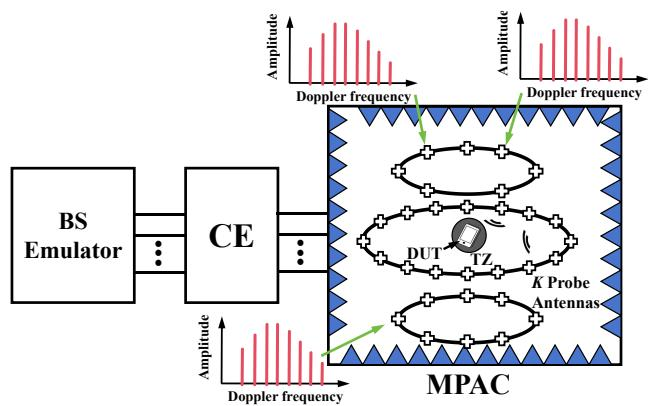
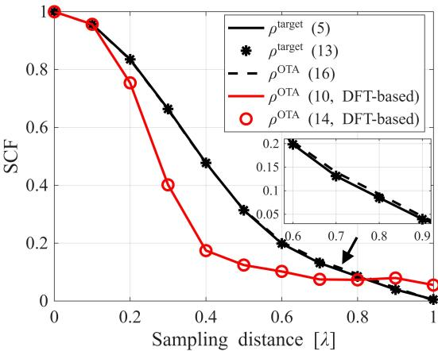
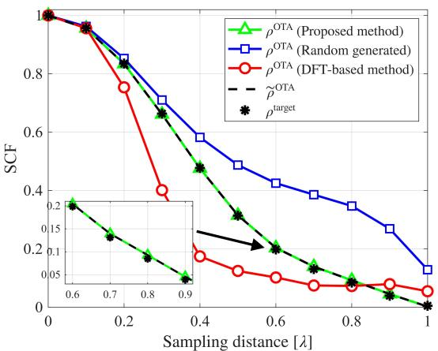
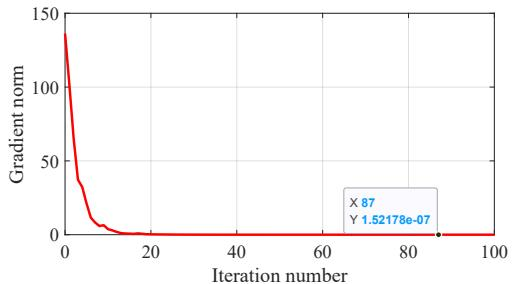
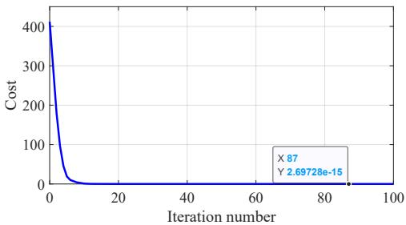

---
tags: [OTA测试, PFS, MPAC, SCF, 信道模拟, 黎曼优化]
created: 2026-06-14
updated: 2026-06-15
---

# Improving Spatial Correlation Emulation Accuracy of Prefaded Signal Synthesis Method under Arbitrary Radio Channels for Random Drops

## 📋 基本信息

| 字段 | 内容 |
|------|------|
| **作者** | Hao Sun, Qingzhou Huan, Yongqing Xu, Haomin Wang, Heng Wang, Yong Li, Wei Fan |
| **期刊/会议** | IEEE Transactions on Antennas and Propagation（推测） |
| **年份** | 2025 |
| **DOI** | 待补充 |
| **链接** | 待补充 |
| **标签** | #OTA测试 #PFS #MPAC #SCF #信道模拟 #黎曼优化 |

## 🎯 核心问题

> 在 PFS（预衰落合成）方法中，由于测试时间限制和信道模拟器内存约束，每个 drop 的初始子径相位固定为确定值，导致不同探头信号间产生非理想交叉相关，使模拟的空间相关函数（SCF）偏离目标值。现有方法（去相关白化、频偏添加、子径数扩展、DFT 相位设计）分别在 DFS 一致性、复杂度或通用性上存在问题——特别是 DFT 方法仅适用于各向同性天线，无法处理方向性天线和双极化场景。**本文要解决：任意天线方向图和极化条件下，PFS 方法中 SCF 模拟精度的通用优化问题。**

## 🔬 现有研究问题与本文方案对比

| 现有方法 | 存在的问题 | 本文解决方案 | 本文优势 |
|----------|-----------|-------------|----------|
| 去相关白化 [21] | 破坏 DFS 和角度域特性 | RSD 优化的初始子径相位 | 保持 DFS 一致性 |
| 子径数扩展 | 计算复杂度高 | 基于黎曼优化的子径相位设计 | 低实现复杂度 |
| 频偏添加 | 改变合成信道的 DFS | 无需修改频偏 | 保持 DFS 原始特性 |
| DFT 相位设计 [23] | 仅适用于各向同性天线 | 考虑方向性和双极化天线 | **任意天线模式下通用** |
| 仅 SPAC 评估 [22] | 无解决方案 | 完整理论 + MPAC 实测验证 | 实际 MPAC 环境验证 |

## 🧠 方法/模型

### 🔑 关键物理直觉

在正式进入数学推导之前，先理解一个核心物理事实：

**空间相关函数（SCF）衡量的是两个不同 DUT 天线位置上的信道到底有多"像"。在理想 OTA 环境中，这个相似度只应该由目标信道的角度功率谱（PAS）和探头几何布局决定。**

但 PFS 方法引入了一个隐藏的破坏者：**初始子径相位的确定性。**

在 PFS 中，K 个 OTA 探头各自发射一个"预衰落"后的信号。每个探头的信号由 M 条子径叠加而成，每条子径携带一个初始相位 $\psi_{k,m}$。如果这些相位在每个 drop 中都是随机的（i.i.d.），那么不同探头之间的交叉相关项在时间平均下会趋近于零——因为它们相位随机振荡、互相抵消。

**然而，实际测试中每个 drop 的初始相位被冻结为固定值（受限于测试时间和内存），这些交叉项不再被平均掉，而是以确定性的方式贡献到 SCF 中，造成系统性偏差。**

> 换言之：**冻结的初始相位 = 探头间被锁定的"伪相关" = SCF 偏离目标值。**

更麻烦的是，当发射天线具有方向性时，不同子径的幅度不再相等（方向图对不同角度子径赋予了不同的增益权重）。DFT 方法假设等幅度子径，因此无法处理这种幅度不均的情况——而实际基站天线几乎都有方向性。

**论文的核心策略**：既然不能改变"相位冻结"这个约束，那就**主动设计初始相位矩阵 $\mathbf{\Psi}$，让探头间的交叉相关项最小化**——相当于在给定约束下找到"最接近随机"的确定性相位配置。

### 核心思路（分步详解）

整篇论文的方法论逻辑链：

> 固定初始相位 → 探头间产生交叉相关 → SCF 偏离目标  
> ↓  
> 数学建模：将 SCF 偏差表达为 $\mathbf{P}\mathbf{P}^{\mathrm{H}}$ 的非对角元素  
> ↓  
> 优化问题：在单位模约束下让 $\mathbf{P}\mathbf{P}^{\mathrm{H}}$ 逼近对角矩阵  
> ↓  
> 求解：黎曼最速下降法（RSD）在复圆流形上迭代优化

#### Step 1：SCF 偏差的数学根源（Section III）

作者首次在 drop 级别采用**时间平均**方法推导目标信道和模拟信道的空间-时间相关函数（STCF），显式引入方向性天线和双极化特性。

关键发现：实际 PFS 模拟的 SCF 包含一个额外的交叉相关项：

$$\mathbf{\Lambda}_{u_1,u_2}^{\mathrm{PFS}} = \boldsymbol{w}_{u_1}\boldsymbol{w}_{u_2}^{\mathrm{H}} \odot (\mathbf{P}\mathbf{P}^{\mathrm{H}})$$

其中 $\mathbf{P} = \mathbf{\Psi} \odot \mathbf{E}$，$\mathbf{\Psi}$ 是初始相位矩阵，$\mathbf{E}$ 是天线方向图 + 极化组合矩阵。

$\mathbf{P}\mathbf{P}^{\mathrm{H}}$ 的对角元素代表每个探头自身的贡献（这是想要的），而非对角元素代表**不同探头之间的交叉相关**（这是不想要的偏差源）。如果 $\mathbf{\Psi}$ 的相位是随机 i.i.d. 的，非对角元素在时间平均下趋近于零；但当相位固定时，它们就变成了确定性的偏差分量。

#### Step 2：优化问题建模（Section IV）

自然的思想：让 $\mathbf{P}\mathbf{P}^{\mathrm{H}}$ 尽可能接近一个对角矩阵 $\mathbf{\Gamma}$。因为对角矩阵意味着探头间无交叉相关，SCF 就不会被污染。

$$\min_{\mathbf{\Psi}} \varepsilon(\mathbf{\Psi}) \triangleq \|\mathbf{P}(\mathbf{\Psi})\mathbf{P}(\mathbf{\Psi})^{\mathrm{H}} - \mathbf{\Gamma}\|_{\mathrm{F}}^2, \quad \text{s.t. } |\psi_{k,m}| = 1$$

约束 $|\psi_{k,m}| = 1$ 是关键——相位必须是纯旋转因子，不能改变子径的幅度（否则会破坏功率分配）。

**为什么这是非凸的？** 因为单位模约束定义了一个复圆（Complex Circle），它是非凸集合。传统方法需要松弛约束（允许 $|\psi_{k,m}| \leq 1$），但松弛后解出的相位幅值可能小于 1，破坏了子径功率。

#### Step 3：黎曼最速下降法（RSD）求解

**直觉**：既然约束空间是一个光滑的流形（Complex Circle Manifold），我们可以直接在流形上做梯度下降，而不是在欧氏空间下降后再硬投影回来。

RSD 的四个步骤：

1. **欧氏梯度**：在无约束的复数空间中计算目标函数的梯度
   $$\nabla\varepsilon(\mathbf{\Psi}) = 4(\mathbf{P}\mathbf{P}^{\mathrm{H}} - \mathbf{\Gamma})\mathbf{P} \odot \mathbf{E}^*$$

2. **黎曼梯度投影**：将欧氏梯度投影到流形的切空间（切线方向是允许的更新方向）
   $$\mathrm{grad}\,\varepsilon(\mathbf{\Psi}_i) = \nabla\varepsilon(\mathbf{\Psi}) - \mathrm{Re}\{\mathrm{tr}(\mathbf{\Psi}_i^{\mathrm{H}}\nabla\varepsilon(\mathbf{\Psi}))\}\mathbf{\Psi}_i$$

   公式含义：从欧氏梯度中减去"法向分量"（垂直于流形的部分），只保留切线分量。因为沿着法线方向更新会破坏 $|\psi_{k,m}| = 1$ 约束。

3. **切线空间更新**：沿负黎曼梯度方向移动一个步长
   $$\boldsymbol{\eta}_i = -\alpha_i \cdot \mathrm{grad}\,\varepsilon(\mathbf{\Psi}_i)$$

4. **回缩（Retraction）**：将切线空间的更新映射回流形上的一个合法点
   $$\mathbf{\Psi}_{i+1} = \mathrm{Retr}_{\mathbf{\Psi}_i}(\boldsymbol{\eta}_i)$$

   对于复圆流形，回缩操作就是逐元素归一化：$\psi_{k,m} \leftarrow \frac{\psi_{k,m}}{|\psi_{k,m}|}$。这保证了每次迭代后相位仍然在单位圆上。

**为什么选黎曼优化而不是拉格朗日乘子法？** 拉格朗日法需要解 KKT 条件，对 K×M 规模的变量来说计算量大且数值不稳定。黎曼方法利用流形的几何结构，每次迭代只需梯度投影 + 回缩，简单且收敛快。

### 系统框图

- **目标信道模型**：3D GBSC 模型，N 个簇，每簇 M 条子径，考虑双极化天线方向图 $g_u$, $g_s$ 和极化组合矩阵 $\mathbf{A}$
- **模拟信道模型**：K 个双极化 OTA 探头，PFS 簇级模拟，探头权重 $\mathbf{w}$ 由 SCF 优化原理预先确定
- **优化框架**：输入初始相位 $\mathbf{\Theta}$ → RSD 迭代优化 → 输出优化相位 $\hat{\mathbf{\Theta}}$

## 📐 关键公式

核心公式为 STCF 定义、模拟 SCF 的矩阵形式、优化目标、欧氏梯度、黎曼梯度投影（详见方法节和结果节）。

**本文的数学贡献**：首次在 drop 级别推导了含方向性天线和双极化的 PFS-SCF 闭合表达式（式 13-15），揭示了 $\mathbf{P}\mathbf{P}^{\mathrm{H}}$ 的非对角元素是 SCF 偏差的根本来源——这个洞察直接引出了后续的优化框架。

## 💻 实验设置

论文通过仿真 + 实际 MPAC 测量双重验证 RSD 方法的有效性。

**场景**：单簇 3D GBSC 模型，16 个探头在方位面均匀分布（22.5° 间距），Rx 天线为各向同性。

**信号与天线**：Tx 天线具有 30° 3dB 波束宽度的方向性（模拟实际基站天线），双极化设置按 3GPP TR 38.827（XPR = 7 dB）。Rx 移动速度 30 m/s，时间采样 100,000 点（0.1ms 间隔，总计 10s）。

**对比基准**：DFT 相位设计方法 [23]（仅适用于各向同性天线，本文作为对比基准）。

**评估指标**：SCF 偏差——目标 SCF 与模拟 SCF 在验证区（TZ）内的差值。

| 参数 | 值 |
|------|-----|
| 场景 | 单簇 GBSC 模型 |
| 探头数 K | 16（方位均匀分布，22.5° 间距） |
| Tx 天线 3dB BW | 30° 方向性 |
| Rx 天线 | 各向同性 |
| 极化 | 3GPP TR 38.827，XPR = 7 dB |
| Rx 速度 | 30 m/s |
| 时间采样 | 100,000 样本，0.1ms 间隔，10s |

## 📊 主要结果

### 图 3：方向性天线下的 SCF 对比——暴露 DFT 的失效

当 Tx 天线为各向同性时，DFT 方法的模拟 SCF 与目标 SCF 在 TZ（验证区）内吻合良好。**但一旦 Tx 天线具有方向性（3dB BW = 30°），DFT 方法的模拟 SCF 与目标 SCF 出现明显偏差**——这正是因为 DFT 方法假设各子径幅度相等，而方向性天线打破了这一假设。

同时，解析推导（式 13-14）与仿真结果吻合，验证了理论推导的正确性。理想 PFS 权重下（即假设相位无限随机化时），SCF 与目标匹配良好——**这确认了偏差确实来自固定相位，而非探头权重设计的问题**。

### 图 4：RSD 优化后的 SCF——偏差基本消除

RSD 优化后，在方向性天线条件下，模拟 SCF 与目标 SCF 在 TZ 内几乎完全重合，显著优于 DFT 基准方法。

**这是本文最核心的定量证据。** 它说明：通过主动设计初始子径相位，可以在不改变任何硬件、不修改探头权重、不影响 DFS 的前提下，让 PFS 的 SCF 模拟精度逼近理论极限。

### 图 5：收敛性能——RSD 高效且稳定

梯度范数和目标函数快速单调下降，验证了 RSD 算法的收敛性。**这很重要**，因为非凸优化没有全局最优保证——但至少在实验条件下，RSD 从未陷入明显的局部极小值，说明复圆流形的几何结构对这个特定问题比较友好。

### 多场景鲁棒性

- **角度扩展（AS）鲁棒性**：在不同 AS 条件下（小→大），RSD 方法始终优于 DFT 方法，说明方法对不同空间色散程度都有效
- **波束宽度适应性**：多种 Tx 天线 3dB BW 条件下（窄→宽波束）均有效，说明方法对不同方向性天线通用
- **随机 drop 一致性**：不同随机 drop 下均能保持 SCF 精度的提升，说明优化的相位配置对不同的信道实现都适用
- **MPAC 实测验证**：在实际 MPAC 环境中，RSD 方法的空间相关偏差显著低于现有方法，证明了方法的工程实用性

### 一个隐含的限制

RSD 方法假设探头权重 $\mathbf{w}$ 已预先优化好。实际上 $\mathbf{w}$ 和 $\mathbf{\Psi}$ 可能存在联合优化的空间——同时优化权重和相位可能获得更好的 SCF 精度。但这也会显著增加优化变量的维度，是一个值得探索但本文未涉及的方向。

## 📝 我的评价

**优点：**

- **问题建模精准**：首次系统性地将 PFS 的 SCF 偏差追溯到 $\mathbf{P}\mathbf{P}^{\mathrm{H}}$ 的非对角元素，这个洞察为相位优化提供了清晰的数学目标。在此之前，DFT 方法只是经验性的相位设计，没有解释"为什么是 DFT 基"以及"什么时候会失效"
- **黎曼优化框架巧妙**：选择 Complex Circle Manifold 上的最速下降法，自然地处理了单位模约束——无需松弛（避免次优性），无需投影（每次回缩即保证可行性），每次迭代的计算量仅为梯度计算 + 逐元素归一化。相比拉格朗日方法，黎曼方法更简洁且数值更稳定
- **通用性是其最大卖点**：适用于任意天线方向图和双极化配置，这是 DFT 方法做不到的。对于 3GPP 标准化场景（TR 38.827/TS 38.151），实际基站天线几乎都有方向性，通用性意味着可落地
- **验证层次完整**：理论推导（STCF 闭合表达式）→ 仿真验证（解析 vs 仿真吻合）→ 算法对比（RSD vs DFT）→ 物理实测（MPAC 环境），四层递进，可靠性高
- **实用性强**：RSD 是离线执行的，不要求实时计算。一次优化可为特定探头布局和天线配置生成一套相位表，后续测试直接查表即可

**不足：**

- **计算复杂度仍高于 DFT 方法**：虽然离线执行，但当探头数 K 或子径数 M 增大时，每次迭代的梯度计算和回缩的复杂度为 $\mathcal{O}(K^2 M)$，需评估在 3GPP 标准典型配置（K=16, M=20）下的实际耗时和可扩展性
- **单簇场景为主，多簇验证不足**：论文主要在单簇 GBSC 模型下验证。多簇场景中不同簇的延迟、角度扩展差异大，相位优化的效果是否会因簇间叠加而减弱？这是一个合理的顾虑
- **$\mathbf{w}$ 和 $\mathbf{\Psi}$ 独立优化的次优性**：假设探头权重已预先确定，但实际中权重和相位存在联合优化空间。联合优化虽然维度更大，但可能带来额外增益，论文未讨论这一方向
- **缺乏与子径数 M 的敏感性分析**：理论上 M 越大，优化的自由度越高，SCF 偏差应越小。但 M 增大也意味着优化变量更多、收敛更慢。论文未系统讨论 M 的取值依据和精度-复杂度 trade-off

**与现有工作的关系：**

- 是对 [23]（DFT 相位设计方法）的直接改进和推广——从各向同性天线扩展到任意天线模式，从经验设计升级为优化驱动
- 与 [21] 的去相关白化方法互补：本文方法不影响 DFS（因为只修改初始相位而不操作已生成的衰落序列），代价是额外的离线计算
- 为 3GPP OTA 测试标准化（TR 38.827/TS 38.151）中的 PFS 实现提供了更精确的通用方案

## 🔗 与通信信道测量的关联

这篇论文表面上是 OTA 测试的 PFS 方法优化，但其核心思想——**通过主动设计确定性相位来逼近随机相位的行为**——对信道测量也有启发。

### 问题类比

| | PFS OTA 测试 | 信道测量 |
|---|---|---|
| 遇到什么困难 | 固定初始相位导致探头间交叉相关 | 有限测量时间/带宽导致估计偏差 |
| 偏差来源 | $\mathbf{P}\mathbf{P}^{\mathrm{H}}$ 的非对角元素 | 有限样本下的相关矩阵估计误差 |
| 不处理的后果 | SCF 偏离目标，OTA 测试不准 | 信道参数（延迟扩展、角度扩展）估计有偏 |
| 本文思路 | 主动设计相位使交叉相关最小化 | 可类比：主动设计导频/激励信号使估计方差最小化 |

### 可迁移思想

论文中最有价值的不是 RSD 算法本身，而是**"识别偏差的矩阵结构来源 → 建模为矩阵逼近问题 → 在约束流形上优化"**的方法论框架：

- **信道探测中的导频设计**：同样面临"在给定功率/峰均比约束下，让信道估计的 MSE 或 CRB 最小"的问题。MSE 矩阵的非对角元素同样是偏差来源，约束同样是单位模（恒包络导频）。黎曼优化框架可以迁移
- **天线阵列的波束赋形权重设计**：在方向图约束下优化赋形权重也是复圆流形上的优化问题
- **信道重构中的相位校准**：多频段测量拼接时，相位偏差可以被建模为矩阵的非对角污染，优化的思路类似

### 论文的迁移局限性

需要注意，PFS 中的相位设计是**离线一次性**的（针对固定探头布局和天线配置），而信道测量中的场景通常是动态变化的（移动的用户、变化的信道），需要在线或自适应的方法——这是 RSD 方法无法直接覆盖的。

## 🔗 相关论文

- [[Li-Sun-TAP-DFT-Phase-PFS-2023]]（前期工作 [23]，DFT 相位设计方法）
- [[Ji-TVT-PFS-Method-Survey-2018]]（PFS 方法综述 [20]）
- [[Zhang-Loh-TWC-PFS-Evaluation-Framework-2024]]（PFS 评估框架 [22]）
- [[Ji-TAP-Band-Stitching-VSA-2022]]（同组 Wei Fan，VSA 带宽拼接，相位校准思路可类比）
- [[Li-TAP-SubTHz-CE-Band-Stitching-2025]]（同组 Wei Fan，sub-THz 信道仿真带宽拼接框架）

## 💡 一句话总结

**本文提出了一种基于黎曼优化的 PFS 初始子径相位设计方法（RSD），通过将 SCF 偏差追溯为 $\mathbf{P}\mathbf{P}^{\mathrm{H}}$ 的非对角元素并在复圆流形上最小化该偏差，首次实现了任意天线方向图和双极化条件下 PFS 方法的 SCF 模拟精度优化，在方向性天线场景下显著优于 DFT 基准方法，并通过 MPAC 实测验证。**

更短：**主动设计初始子径相位，让探头间的"伪相关"最小化，用黎曼优化在复圆上找到最优解。**

核心方法论——"识别偏差的矩阵结构来源 → 建模为矩阵逼近 → 在约束流形上优化"——可迁移到信道探测的导频设计、阵列赋形优化、多频段相位校准等场景。但最关键的可迁移价值不在于 RSD 算法本身，而在于**从矩阵非对角结构寻找偏差根因的思维方式**。
